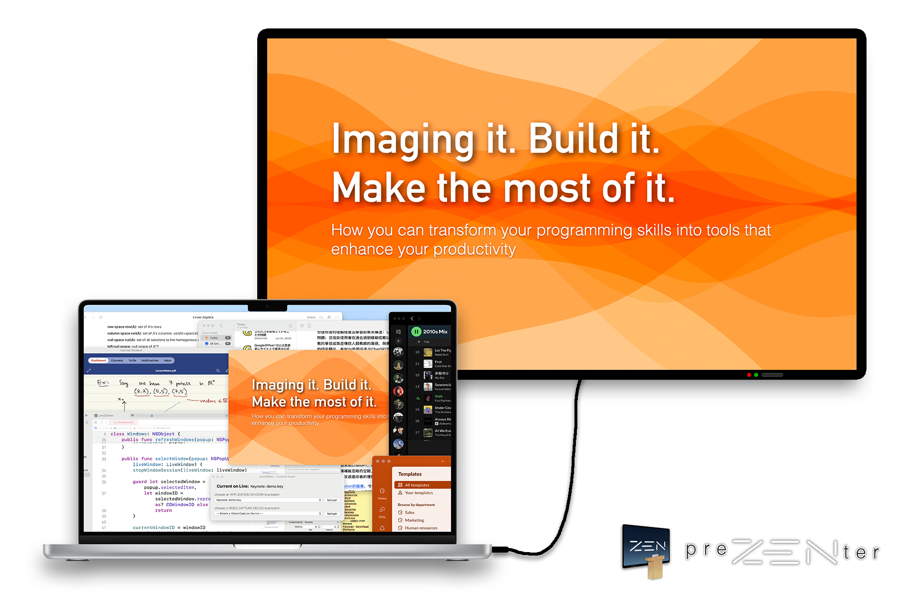

# preZENter

A Mac application that presents a specific application window or video capture device live on separate display.

Inspired by various video conferencing software's Share Screen feature. Influenced by [Presenter Mode](https://github.com/benjones/presenterMode) by [Ben Jones](https://github.com/benjones).

**Quick Links**: [Get the latest release](https://github.com/homeofhx/preZENter/releases/latest) | [Wiki](https://github.com/homeofhx/preZENter/wiki) | [Quick start guide](https://github.com/homeofhx/preZENter/wiki/How-to-Use-%E2%80%90-The-Basics) | [Troubleshooting](https://github.com/homeofhx/preZENter/wiki/Known-Issues-&-Limitations)

## Features

**Selective App Window Presenting.** Presents only one specific app's window, so your audience will focus on what you want them to see;

**External Video Capture Integration.** Supports external video capture devices (e.g., HDMI/USB capture cards) for enhanced presentation flexibility;

**Adaptive Display Compatibility.** Automatically adjusts the Live Window to various aspect ratios and resolutions, ensuring optimal presentation on different kinds of displays;

**Legacy Mac OS Support.** Compatible with some older Mac OS, as low as 10.12 (Sierra).

## Technical Details

**Mac OS Compatibility:** Depends on the build. **X86_64 build:** 10.12 (Sierra) to 10.14 (Mojave); **Universal 2 build:** 10.15 (Catalina) or newer.

**Frameworks Used** (original program): [AVFoundation](https://developer.apple.com/documentation/avfoundation) (for external video capture devices capturing), [AppKit](https://developer.apple.com/documentation/appkit) ([Cocoa](https://developer.apple.com/library/archive/documentation/Cocoa/Conceptual/CocoaFundamentals/WhatIsCocoa/WhatIsCocoa.html), for the UI), [Core Graphics](https://developer.apple.com/documentation/coregraphics) (for app window capturing)

**Build Environment:** The original program and X86_64 build were written in Xcode 10 and Swift 4.2. Universal 2 build was built on the latest Xcode, with `Deployment Target=10.15` and `Architecture=$(ARCHS_STANDARD)` (Apple Silicon, Intel).

>Note when building on Xcode 10: make sure to comment out the part involving `CGRequestScreenCaptureAccess()`, otherwise Xcode can't build the project.

## Thanks

[@benjones](https://github.com/benjones) for suggesting the framework and logic for capturing app windows