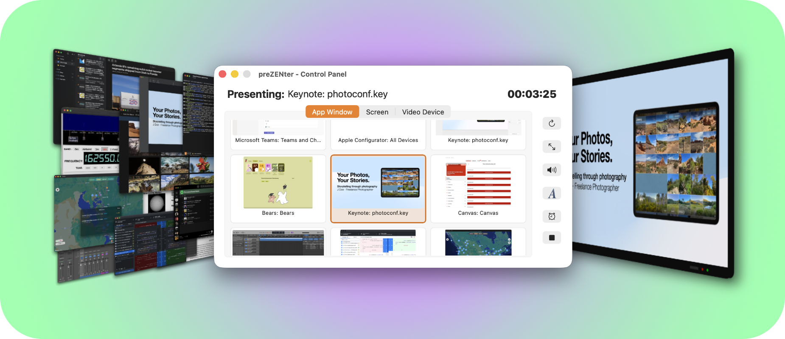

# preZENter

A presentation utility application for Mac computers. It presents an application window, screen, or video capture device you select, live on a separate display.

Inspired by various video conferencing software's Share Screen feature. Influenced by [Presenter Mode](https://github.com/benjones/presenterMode) by [Ben Jones](https://github.com/benjones).

**Quick Links**: [Get the latest release](https://github.com/homeofhx/preZENter/releases/latest) | [Wiki](https://github.com/homeofhx/preZENter/wiki) | [Quick start guide](https://github.com/homeofhx/preZENter/wiki/How-to-Use-%E2%80%90-The-Basics) | [Troubleshooting](https://github.com/homeofhx/preZENter/wiki/Known-Issues-&-Limitations)

## Features

- **Selective Content Presenting.** Presents only what you want your audience to see.

- **External Video Capture Device Support.** Supports most plug-and-play video capture devices, as well as iOS devices' screens.

- **Handy Tools.** Contains helpful tools for presentation, including Presenter Timer, Idle Screen, Display/Audio Switcher, and Menu Bar Shortcuts.

- **Quick Setup.** Easy to use, less to learn, so you can focus more on your presentation rather than the setup.

## Technical Details

**Mac OS Compatibility:** 10.13 (High Sierra) or newer.

**Frameworks Used:** [ScreenCaptureKit](https://developer.apple.com/documentation/screencapturekit) (app window & screen capturing), [Core Graphics](https://developer.apple.com/documentation/coregraphics) (legacy app window & screen capturing), [AVFoundation](https://developer.apple.com/documentation/avfoundation) (external devices capturing), [AppKit](https://developer.apple.com/documentation/appkit) ([Cocoa](https://developer.apple.com/library/archive/documentation/Cocoa/Conceptual/CocoaFundamentals/WhatIsCocoa/WhatIsCocoa.html) for the UI)

**Development Environment:** Latest Xcode since June 2026 (Xcode 10 since the first release).

**Beta Version:** Clone/download this repository, then build and run the project in Xcode. Please note that beta versions can contain unimplemented features, more issues, and unpredictable behaviors.

**License:** [GNU General Public License v3.0](LICENSE)

## Thanks

[@benjones](https://github.com/benjones) for suggesting the approach for capturing app windows and the idea of menu bar shortcuts.